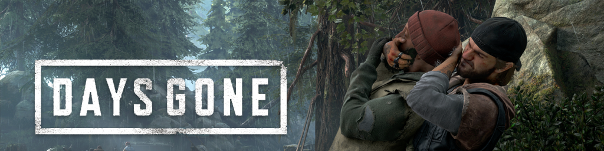

## Dayz Gone

## На геймпаде

- Alan Wake II (I ?)
- Firewatch 
- What Remains of Edith Finch 
- Gone Home 
- Life is Strange 
- Tell Me Why (от создателей Life is Strange )
- JOURNEY 
- Telltale Games (The Walking Dead, The Wolf Among Us, Batman) 
- The Last of Us
- RDR 2
- Black Myth: Wukong (2024) еще не вышла
- Star Wars Outlaws (2024) еще не вышла 
- Silent Hill 2 (2024, ремейк)
- Horizon Forbidden West (2022, PC-2024) Это прямое сюжетное продолжение Horizon Zero Dawn, так что проходить по очереди.
- Indiana Jones and the Great Circle - вышла 
- Dragon Age The Veilguard
- The Alters 
- The Forgotten City

## классика

- God of War (2018, PC-версия 2022)
- Uncharted 4: A Thief’s End (2016, PC-версия 2022 в составе Legacy of Thieves Collection)
- Control (2019)
- Dead Space (2023, ремейк) или на пк
- The Callisto Protocol (2023)
- Dark Souls
- Elder Rings
- Ad infinitum 
- Alone in the Dark
- A Plague Tale: Innocence и A Plague Tale: Requiem (прямое сюжетное продолжение)
- The Vanishing of Ethan Carter
- The Walking Dead 

## КИНО

- Detroit: Become Human
- Heavy Rain 
- Beyond: Two Souls
- Until Dawn (выживач, много QTE, но он не сложное, игра считается культовой)
- The Quarry (Духовный наследник Until Dawn)
- Erica (именно КИНО с живыми актерами)

## Life is strange

1. Life is Strange (2015) — начните с оригинальной игры, чтобы понять механику перемотки времени и познакомиться с Макс и Хлоей. Life is Strange: Before the Storm (2017) — приквел, который углубляет историю Хлои и Рэйчел. Бонусный эпизод Farewell играйте после основных эпизодов. Remastered Collection включает оригинал + Before the Storm + Farewell 
2. The Awesome Adventures of Captain Spirit (2018) — короткий пролог к Life is Strange 2.
3. Life is Strange 2 (2018–2019) — новая история с отсылками к первой части.
4. Life is Strange: True Colors (2021) — самостоятельная история, дополнение Wavelengths играйте после основного сюжета.
5. Life is Strange: Double Exposure (2024) — продолжение истории Макс, лучше играть после оригинала и Before the Storm.

## На PC

- Rage и Rage 2. Довольно старые, но надо глянуть.
- Doom: The Dark Ages - Новая игра с не отключаемым RT, еще не вышла
- Kingdom Come: Deliverance II
- The Forest Prison (дело не в графе, но надо глянуть)
- Watch Dog

## Заценить:

- Avatar: Frontiers of Pandora (еще не появилась)
- Assassin’s Creed Shadows
- Metal Gear Solid Delta: Snake Eater (август 2025)
- Dragon's Dogma 2
- Dragon Age: The Veilguard
- Senua’s Saga: Hellblade II

## Заценить платформеры

- Hollow Knight
- Trine
- The Cave

## Перепройти

Fallout 3-NW-4  
Дивинити и дивинити 2  
Ведьмак 3 добить, Перепройти 1 и 2?  

## Игры типа "The Painscreek killings"

1.  Dear Esther (2012)
2.  Evidence: The Last Ritual / Missing: Since January (2006)
3.  Everybody’s Gone to the Rapture (2015)
4.  Firewatch (2016)
5.  Gone Home (2013)
6.  Her Story (2015)
7.  INFRA (2016–2020)
8.  Kona II: Brume (2023)
9.  Magurele Mystery (2021)
10. Murdered: Soul Suspect (2014)
11. Myst (2021 Remake)
12. OBSERVATION (2019)
13. Oxenfree (2016)
14. Paradise Killer (2020)
15. Quern – Undying Thoughts (2016)
16. Return of the Obra Dinn (2018)
17. Sherlock Holmes: Crimes and Punishments (2014)
18. SOMA (2015)
19. Tacoma (2017)
20. Telling Lies (2019)
21. The Beast Inside (2019)
22. The Forgotten City (2021)
23. The House of Da Vinci (серия, 2017–2023)
24. The Inheritance of Crimson Manor (2022)
25. The Occupation (2019)
26. The Suicide of Rachel Foster (2020)
27. The Talos Principle (2014)
28. The Vanishing of Ethan Carter (2014)
29. The Witness (2016)
30. What Remains of Edith Finch (2017)
31. Who Pressed Mute on Uncle Marcus? (2022)
32. Return of the Obra Dinn (2018) 
